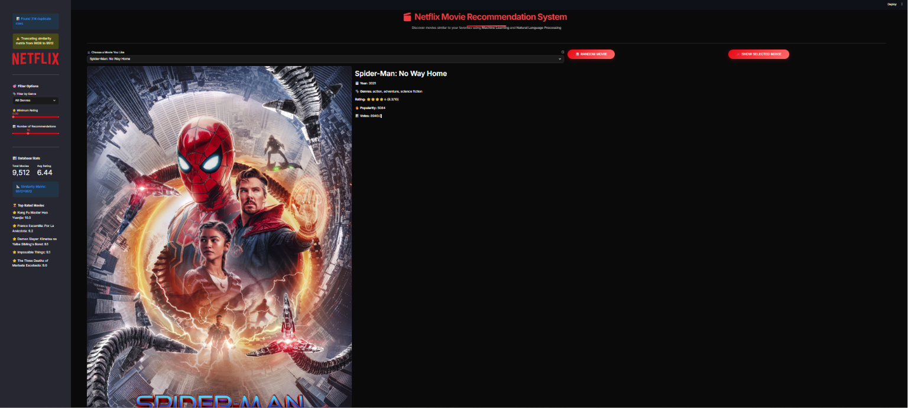
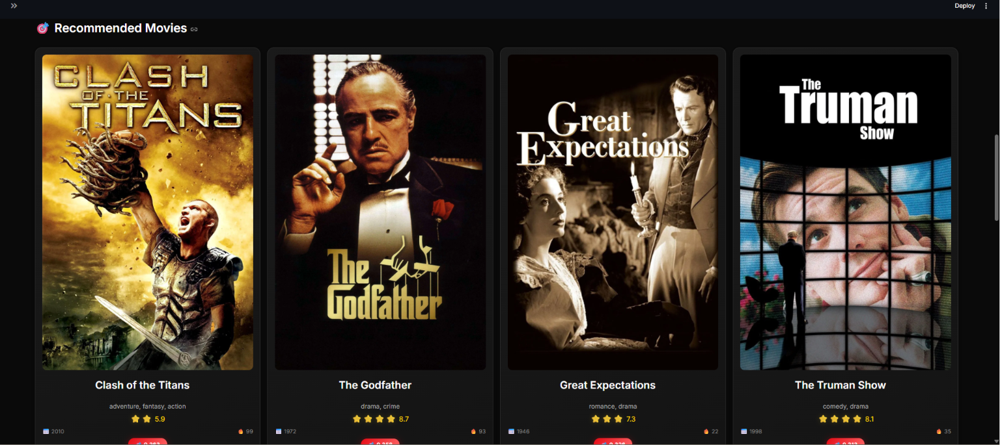

# 🎬 Netflix Movie Recommendation System

A **Content-Based Movie Recommendation System** built using **Python, Machine Learning, Natural Language Processing (NLP), and Streamlit**. The system recommends movies similar to a selected movie by analyzing its content such as **genre, overview, and language** using **TF-IDF Vectorization** and **Cosine Similarity**.

---

# 📌 Project Overview

This project helps users discover movies similar to their favorite ones without relying on user ratings or watch history. Instead, it analyzes movie metadata and story descriptions to identify content similarities.

---

# 🚀 Features

* 🎥 Movie Recommendation based on content
* 📖 Uses Genre, Overview, and Language
* 🧠 TF-IDF Vectorization for text processing
* 📊 Cosine Similarity for finding similar movies
* 🖼️ Displays Movie Posters
* ⭐ Displays Ratings
* 📅 Displays Release Year
* 🔥 Displays Popularity Score
* 🌐 Interactive Streamlit Web Application

---

# 🛠️ Technologies Used

* Python
* Pandas
* NumPy
* Scikit-learn
* NLTK
* Streamlit
* Pickle

---

# 📂 Project Structure

```text
Netflix-Recommendation-System/
│
├── dataset/
│      movies.csv
│      clean_movies.csv
│
├── notebooks/
│      01_EDA.ipynb
│      02_Preprocessing.ipynb
│      03_Model.ipynb
│
├── models/
│      similarity.pkl
│      vectorizer.pkl
│      movies.pkl
│
├── app.py
├── requirements.txt
└── README.md
```

---

# 🔄 Project Workflow

```text
                Movie Dataset
                      │
                      ▼
             Data Collection
                      │
                      ▼
               Exploratory Data Analysis
                      │
                      ▼
               Data Preprocessing
        ├── Remove Duplicates
        ├── Handle Missing Values
        ├── Convert Release Date
        ├── Extract Release Year
        ├── Clean Text
        └── Create Tags Column
                      │
                      ▼
             Text Preprocessing (NLP)
        ├── Lowercase Conversion
        ├── Remove Punctuation
        ├── Remove Stopwords
        └── Stemming
                      │
                      ▼
            TF-IDF Vectorization
                      │
                      ▼
          Numerical Feature Matrix
                      │
                      ▼
            Cosine Similarity Matrix
                      │
                      ▼
          Recommendation Function
                      │
                      ▼
      Save Trained Files (.pkl Models)
                      │
                      ▼
            Streamlit Web Application
                      │
                      ▼
          User Selects a Movie
                      │
                      ▼
      Recommend Top 10 Similar Movies
```

---

# ⚙️ Machine Learning Pipeline

```text
Movie Title
      │
      ▼
Genre + Overview + Language
      │
      ▼
Create Tags Column
      │
      ▼
Text Cleaning
      │
      ▼
TF-IDF Vectorizer
      │
      ▼
Movie Vectors
      │
      ▼
Cosine Similarity
      │
      ▼
Top 10 Similar Movies
```

---

# 📊 Recommendation Algorithm

This project uses a **Content-Based Filtering** approach.

### Input Features

* Genre
* Overview
* Original Language

### NLP Techniques

* Lowercase Conversion
* Stopword Removal
* Stemming
* TF-IDF Vectorization

### Similarity Measure

* Cosine Similarity

---

# 📈 Model Flow

```text
Input Movie
      │
      ▼
Find Movie Index
      │
      ▼
Retrieve Similarity Scores
      │
      ▼
Sort Scores (Highest First)
      │
      ▼
Ignore Selected Movie
      │
      ▼
Return Top 10 Movies
```

---

# 💻 How to Run

## 1. Clone Repository

```bash
git clone <repository_url>
```

## 2. Install Dependencies

```bash
pip install -r requirements.txt
```

## 3. Run the Application

```bash
streamlit run app.py
```

---

# 📊 Output

The application displays:

* Movie Poster
* Movie Title
* Genre
* Rating
* Release Year
* Popularity
* Similarity Score

---

# 📚 Future Improvements

* Hybrid Recommendation System
* Fuzzy Movie Search
* User Authentication
* Personalized Recommendations
* Trending Movies Section
* Top Rated Movies
* Movie Search Suggestions
* Genre-Based Filtering
* Language-Based Filtering
* Recommendation Explanation

---

# 🎯 Learning Outcomes

Through this project, I learned:

* Data Cleaning and Preprocessing
* Exploratory Data Analysis (EDA)
* Natural Language Processing (NLP)
* TF-IDF Vectorization
* Cosine Similarity
* Content-Based Recommendation Systems
* Model Serialization using Pickle
* Streamlit Web Application Development
* End-to-End Machine Learning Project Development

* ## Application Preview

### Home Screen



### Recommendations



---

# 👨‍💻 Author

**Hariom Singh**

B.S. Computer Science | Data Science | Machine Learning | Python | SQL |
